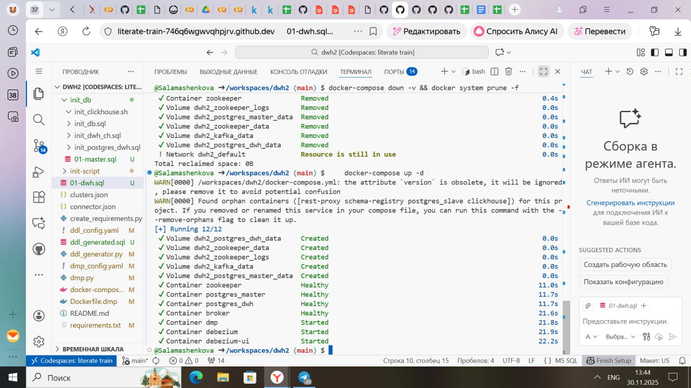
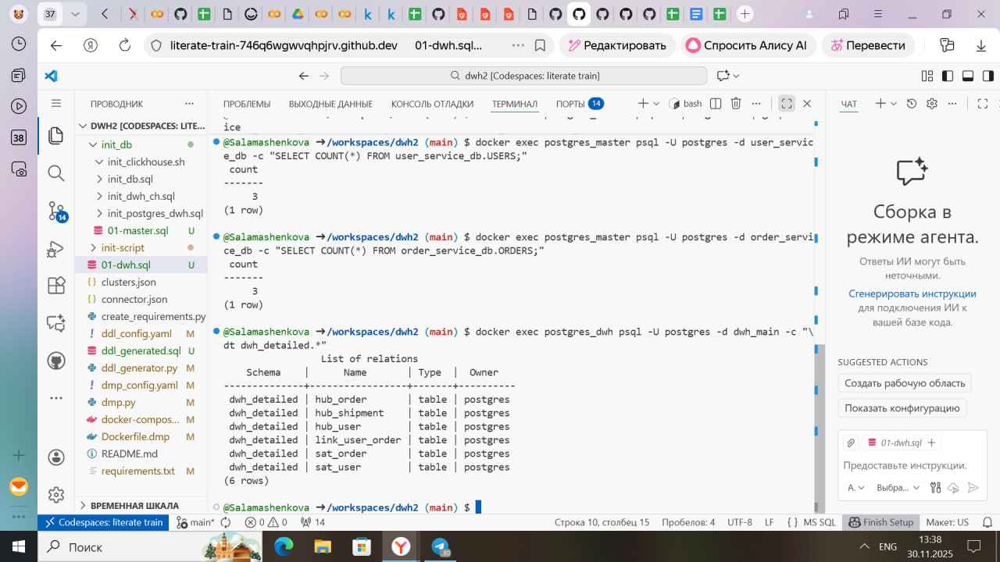
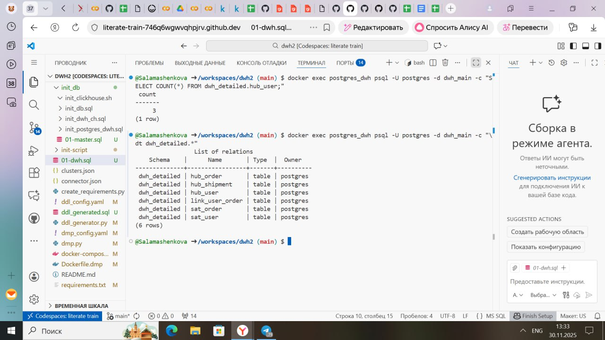
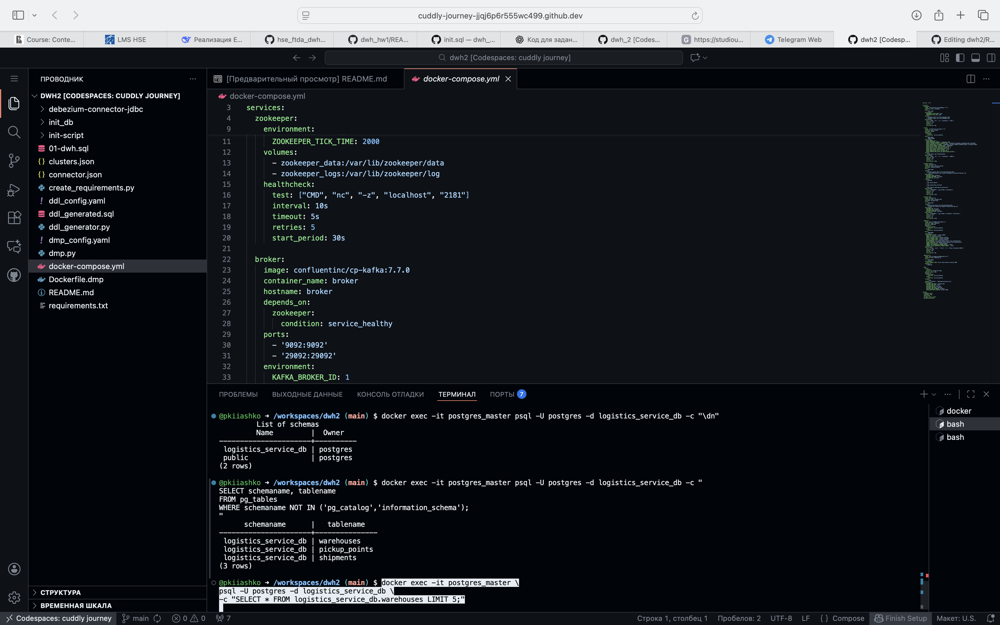
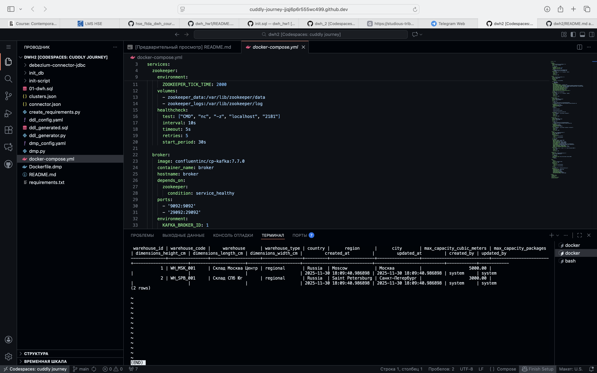

## Авторы
1. **Полина Кияшко**, [shinshiiila](https://t.me/shinshiiila)
3. **Саламашенкова Дарья**, [salamashenkovadasha](https://t.me/salamashenkovadasha)

ФТиАД

## Как запустить проект

Клонирование проекта из этого репо:
```
git clone https://github.com/Salamashenkova/dwh2
```
Запуск инициализации БД:
```
docker-compose up --build
```
Параметры для подключения:
Мастер
```
docker exec -it postgres_master psql -U postgres
```
DWH:
```
docker exec -it postgres_dwh psql -U postgres
```
Примеры вывода таблиц для Мастер:
```
docker exec -it postgres_master psql -U postgres -d user_service_db -c "SELECT * FROM user_service_db.USERS LIMIT 3;"

docker exec -it postgres_master psql -U postgres -d order_service_db -c "SELECT * FROM order_service_db.ORDERS LIMIT 3;"

docker exec -it postgres_master psql -U postgres -d logistics_service_db -c "SELECT * FROM logistics_service_db.warehouses LIMIT 5;"
 
```
Вывод списка всех таблиц в DWH:
```
docker exec -it postgres_dwh psql -U postgres -d dwh_main -c "\dt dwh_detailed.*"
```

Пример вывода таблицы в DWH:
```
docker exec -it postgres_dwh psql -U postgres -d dwh_main -c "SELECT * FROM dwh_detailed.hub_user;"
```

## Результаты:










